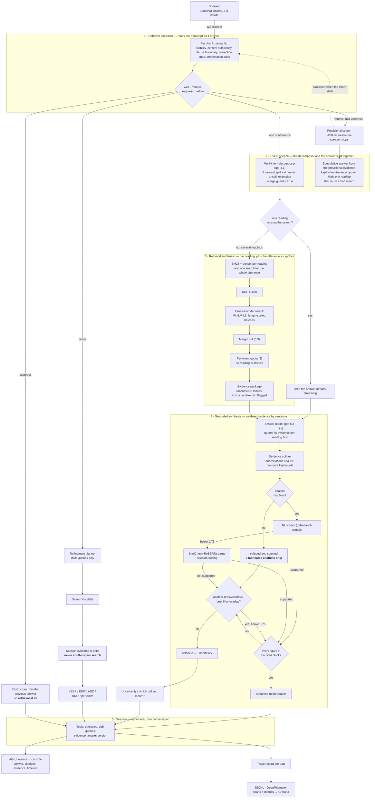
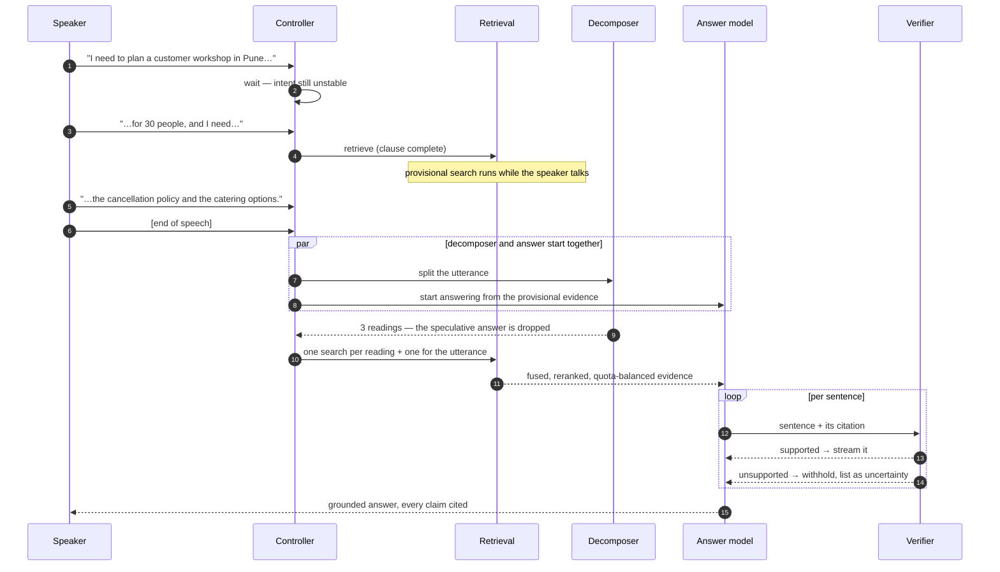
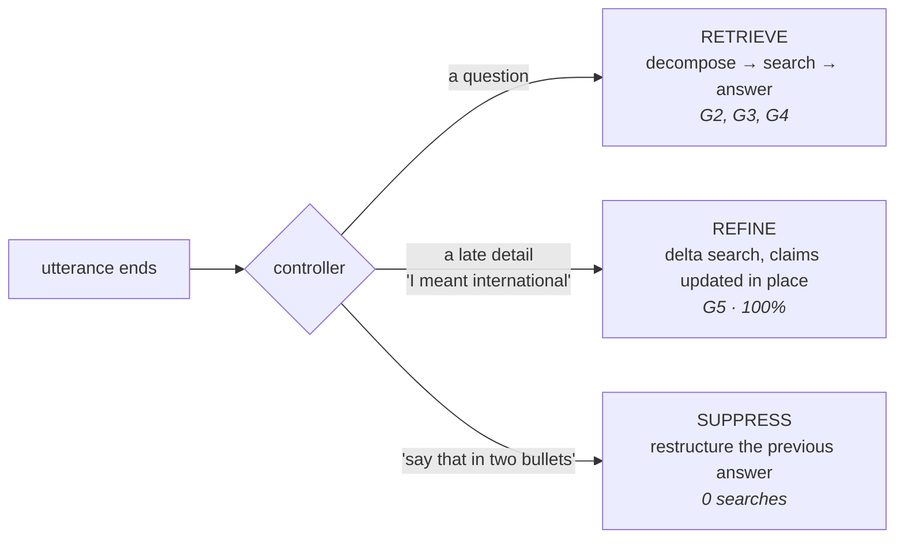

# Architecture, end to end

Three diagrams of the same system: the turn pipeline, the timeline of one utterance, and the
three routes a turn can take. Every box is a module in `src/slr/`; the numbers are measured
in [`BENCHMARK_REPORT.md`](BENCHMARK_REPORT.md).

## 1. The pipeline

## 2. One turn on the clock

## 3. The three routes

